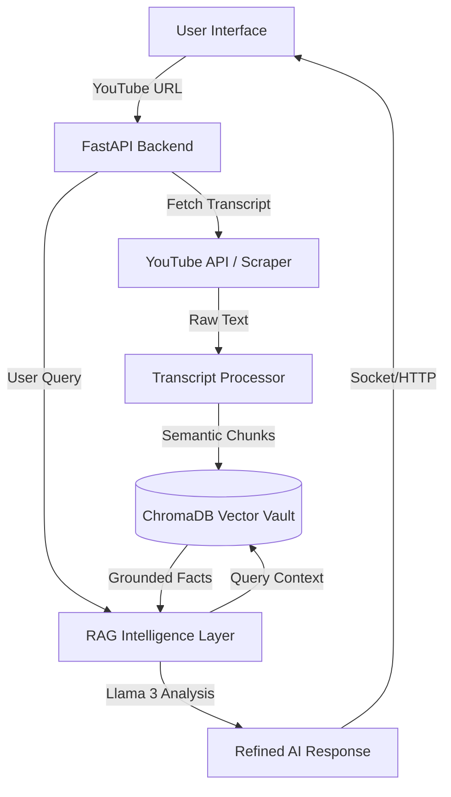
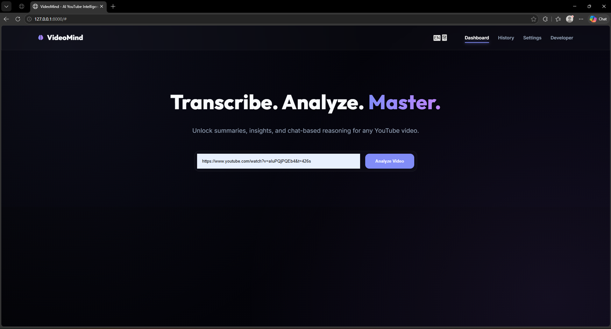

# 🧠 VideoMind: AI-Powered YouTube Intelligence Platform

<p align="center">
  
  
  
  
  
</p>

---

## 📽️ Project Overview
**VideoMind** is a production-grade AI platform designed to transform long-form YouTube content into searchable, conversational, and multilingual knowledge systems. By leveraging **Retrieval-Augmented Generation (RAG)** and **transcript-grounded reasoning**, VideoMind eliminates the need to watch hours of video, providing instant, hallucination-free insights through a premium, futuristic interface.

### 🚩 The Problem
Modern users are overwhelmed by high-volume video content. Extracting specific information from a 2-hour lecture or technical tutorial is time-consuming, and traditional AI chatbots often hallucinate because they lack direct grounding in the video's actual spoken words.

### ✅ The VideoMind Solution
VideoMind solves this by:
- **Grounding AI** in the exact transcript chunks of the video.
- **Semantic Search**: Finding the needle in the haystack across thousands of words.
- **Multilingual Support**: Breaking language barriers for global accessibility.
- **Conversational Memory**: Allowing deep, follow-up reasoning about complex topics.

---

## 🏗️ System Architecture

### High-Level Interaction Flow


---

## 🚀 Core Features & AI Pipeline

### 1. RAG Intelligence Pipeline
Unlike generic AI, VideoMind uses a **grounded RAG pipeline**:
- **Chunking**: Intelligent sliding-window chunking to preserve context.
- **Embedding**: Converting text into 1536-dimension vectors for semantic similarity.
- **Retrieval**: Extracting the top relevant "knowledge blocks" for every user query.

### 2. Anti-Hallucination System
We implemented a strict **Fact-Anchor** policy. The AI is instructed to only answer using provided transcript blocks. If information isn't in the video, the AI transparently informs the user, preventing "creative hallucinations."

### 3. Conversational Memory Architecture
VideoMind uses a **Context-Aware Memory Buffer**. It doesn't just see your last message; it understands the entire thread, allowing for follow-up queries like *"Can you elaborate on that point?"* or *"How does this relate to what was said earlier?"*

### 4. Multilingual Engine
Fully integrated support for **English (EN)** and **Hindi (HI)**.
- Real-time UI translation.
- Cross-lingual AI analysis (Ask in Hindi about an English video).

---

## 🛠️ Technical Stack
| Layer | Technologies |
|--- |--- |
| **Frontend** | Vanilla JS, CSS (Aether V3 System), HTML5, Marked.js |
| **Backend** | Python 3.10+, FastAPI, Uvicorn |
| **AI Orchestration** | LangChain, LangGraph |
| **Models** | Llama 3.3 70B (Groq), Sentence-Transformers |
| **Database** | ChromaDB (Vector DB), LocalStorage (State) |
| **DevOps** | Docker, Git, Python-Dotenv |

---

## 🚧 Challenges & Engineering Solutions

### 1. The "Hallucination" Trap
**Problem**: AI would give general knowledge answers instead of specific video facts.
**Solution**: Implemented **Strict Context Grounding** prompts and MMR (Max Marginal Relevance) retrieval to ensure the AI *only* uses the transcript as its source of truth.

### 2. Follow-up Context Tracking
**Problem**: Users would ask "Explain more," and the AI would lose track of what it just said.
**Solution**: Developed a **Memory-Augmented Retrieval** flow where the previous 8 turns of conversation are used to re-calculate the next context window.

### 3. UI Navigation Stability
**Problem**: Traditional navigation caused page reloads and lost analysis state.
**Solution**: Built a **Dynamic View Switcher** using Event Delegation and CSS state-locking (`active-view`) to ensure smooth, SPA-like transitions.

### 4. Broken Routing
**Problem**: Multiple views (Dashboard, History, Settings) were overlapping.
**Solution**: Standardized on a **Display-None-First** logic where the JS explicitly handles view entry/exit animations.

---

## 💼 Business & Enterprise Use Cases
- **Corporate Training**: Instantly turn employee training videos into searchable Q&A bots.
- **Educational Platforms**: Provide students with an AI tutor for every lecture video.
- **Legal & Compliance**: Search hours of recorded depositions for specific keywords or themes.
- **Research Automation**: Summarize and extract data points from technical webinars.

## 📸 Platform Walkthrough

### 1. Unified AI Dashboard
The primary gateway for video intelligence. Simply paste a YouTube URL to begin the deep analysis.


### 2. Grounded Analysis & Summary
The AI generates transcript-anchored summaries and technical insights, which are then rendered in a premium marked-down interface.


### 3. History Vault
All processed videos are automatically saved to a persistent history grid for instant retrieval and re-review.


### 4. Intelligent Preferences
Fine-tune the AI's response length and language through the customized glassmorphism settings panel.


---

## 📂 Project Structure
```text
VideoMind/
├── backend/
│   ├── main.py            # API Entry Point
│   ├── rag_service.py     # LangChain & Vector Logic
│   └── transcript_env.py  # Transcript Fetching Engine
├── frontend/
│   ├── index.html         # Aether V3 UI Structure
│   ├── style.css          # Premium Design System
│   ├── app.js             # Navigation & State Logic
│   └── photo/             # Professional Assets
├── requirements.txt       # Dependencies
└── .env                   # AI Keys & Config
```

---

## ⚙️ Local Setup Instructions

1. **Clone the Repository**
   ```bash
   git clone https://github.com/bittush8789/VideoMind-AI.git
   cd VideoMind-AI
   ```

2. **Create Virtual Environment**
   ```bash
   python -m venv venv
   # Activate on Windows:
   venv\Scripts\activate
   # Activate on Mac/Linux:
   source venv/bin/activate
   ```

3. **Install Dependencies**
   ```bash
   pip install -r requirements.txt
   ```

4. **Environment Configuration**
   Create a `.env` file in the root directory:
   ```env
   GROQ_API_KEY=your_groq_api_key_here
   MODEL_NAME=llama-3.3-70b-versatile
   ```

5. **Run the Application**
   ```bash
   uvicorn backend.main:app --reload
   ```
   *Open `http://127.0.0.1:8000` in your browser.*

---

## 🐳 Deployment via Docker

1. **Build the Image**
   ```bash
   docker build -t videomind-ai .
   ```

2. **Run the Container**
   ```bash
   docker run -p 8000:8000 --env-file .env videomind-ai
   ```

3. **Or Use Docker Compose (Recommended)**
   ```bash
   docker-compose up -d
   ```

---

## 👤 Author
**Bittu Sharma**
*AI Engineer & LLMOps Architect*

- **LinkedIn**: [Bittu Sharma](https://www.linkedin.com/in/bittu-kumar-54ab13254/)
- **Blog**: [Hashnode Portfolio](https://bittublog.hashnode.dev/)
- **GitHub**: [Profile](https://github.com/)

---

## 📜 License
This project is licensed under the MIT License - see the [LICENSE](LICENSE) file for details.

<p align="center">Built with ❤️ for the Future of AI Intelligence</p>
